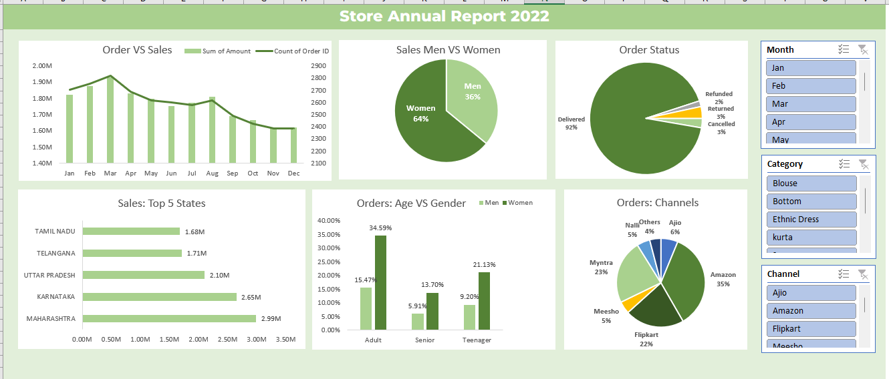

# 📊 Excel Sales Data Analysis – Vrinda Store

## 📌 Project Overview
This project analyzes sales data of *Vrinda Store* using Microsoft Excel to uncover key business insights related to sales performance, customer demographics, order trends, and sales channels.  
The objective is to demonstrate practical Excel data analysis skills, including data cleaning, exploratory analysis, KPI calculation, and dashboard creation.

---

## 🎯 Objective
- Analyze sales and order data to identify trends and patterns
- Understand customer behavior across gender, age groups, and regions
- Evaluate sales performance by channels and order status
- Present insights through an interactive Excel dashboard for decision-making

---

## 🛠 Tools & Techniques Used
- Microsoft Excel
- Data Cleaning & Validation
- Pivot Tables & Pivot Charts
- Calculated Columns & KPIs
- Interactive Dashboard (Charts & Filters)

---

## 📂 Project Structure
```
Vrinda-Store-Excel-Data-Analysis/
│
├── data/
│ └── 01_raw_sales_data.xlsx
│
├── project/
│ └── 02_sales_analysis_and_dashboard.xlsx
│
├── screenshots/
│ └── dashboard_preview.png
│
└── README.md
```
---

## 📄 File Description

### 1️⃣ 01_raw_sales_data.xlsx
- Contains the original dataset
- Data is kept unchanged to maintain transparency
- Used as the base for all analysis

### 2️⃣ 02_sales_analysis_and_dashboard.xlsx
This workbook contains the complete analysis and dashboard.

**Sheet Breakdown:**
- `Cleaned_Data` → Cleaned and structured dataset used for analysis    
- `Dashboard` → Final interactive Excel dashboard
- `Notes_Data_Cleaning` → Summary of data cleaning and preparation steps  
- `Insights` → Presenting the main findings from the data analysis  
- `Analysis_Sales_vs_Orders` → Comparison of sales value and order volume  
- `Analysis_Gender_Wise_Sales` → Sales distribution by gender  
- `Analysis_Age_Gender_Distribution` → Customer demographics analysis  
- `Analysis_Order_Status` → Order completion and cancellation analysis  
- `Analysis_State_Wise_Sales` → State-wise sales performance  
- `Analysis_Sales_Channels` → Channel-wise contribution to sales

---

## 🧹 Data Cleaning Summary
- Removed blank and invalid records
- Standardized date formats
- Grouped age values into meaningful buckets
- Verified consistency of order status and sales channels
- Ensured correct data types for numerical analysis

---

## 📈 Key Insights
- A small percentage of products contribute to a majority of total sales
- Female customers contribute higher order volume compared to male customers
- Certain states generate significantly higher revenue than others
- Online sales channels outperform offline channels
- Order cancellations and returns impact overall profitability

---

## 💡 Business Recommendations
- Focus marketing efforts on high-performing states and customer segments
- Improve retention strategies for high-value customers
- Optimize sales channel mix to maximize profitability
- Reduce order cancellations through better fulfillment processes

---

## 📊 Dashboard Preview
The dashboard provides a consolidated view of KPIs, trends, and filters for easy decision-making.



---

## 📎 Conclusion
This project demonstrates end-to-end Excel data analysis skills, from raw data handling to insight-driven dashboard creation.  
It is designed to reflect real-world business analysis and is suitable for entry-level data analyst roles.

---

## 👤 Author
Arnab Sinha  
Website: https://arnabsinha.wuaze.com  
Aspiring Data Analyst
